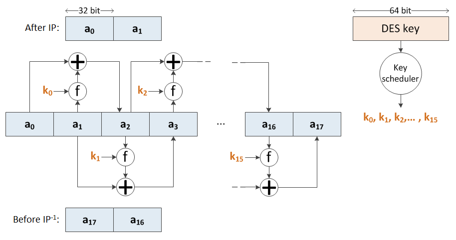
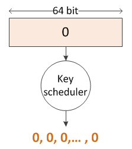
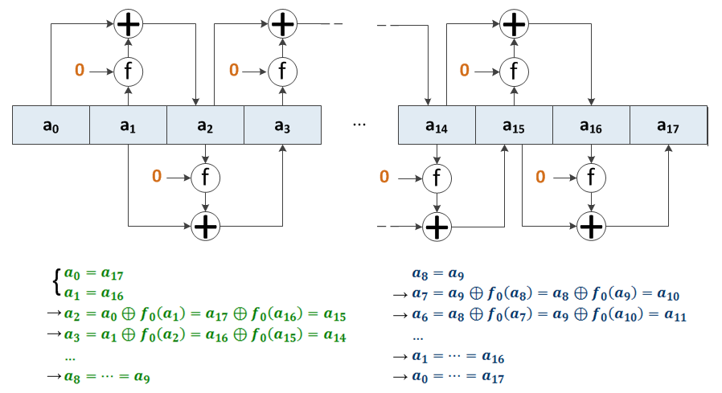

# Writeup for Google CTF 2018 Qualification Round
- Challenge: **DM COLLISION**
- By: _Nguyễn Duy Hiếu_, an undergraduate student from _ACTVN (Academy of Cryptography Techniques, Vietnam)_.
- Contact: nguyenduyhieukma@gmail.com

## Challenge summary
- Competitors were given a DES-like block cipher in which the 8 S-boxes was rearranged.
- To get the FLAG, one must find:
    1. Two different `(key, inputblock)` pairs but same `inputblock XOR outputblock`.
    2. A `(key, inputblock)` such that `inputblock == outputblock`.

## An overview of how DES works
1. Permutes 64 bits of an input block, then cuts into 2 halves: `a[0]`, `a[1]`.
2. Computes `a[i+2] = a[i] XOR f(a[i+1], k[i])` for `i = 0,1,...,15` (Figure 1). More about `f`:
    - `f` takes a 32-bit block and a 48-bit subkey (derived from 64-bit DES key) as input to produce another 32-bit block.
    - S-boxes are used internally by `f` to provide the confusion property.
3. Does the inverse of the initial permutation on `(a[17], a[16])`, then outputs the result.

  
_Figure 1: The processing of `a[i]`'s._


## Key ideas
1. Only 56/64 bits of a DES key are actually used for encyption. The remaining 8 bits are used for parity check. In our case, those parity bits were ignored and flipping them would not affect the output block. Looks like we could find different `(key, inputblock)` pairs but same `inputblock XOR outputblock`, right?
2. Since subkeys are constructed with bits picked from the DES key, if we let it be all zeros (or all ones) then all subkeys will be the same (Figure 2). In fact, a DES key with this property is called 'weak key' and there are 4 DES weak keys.

  
_Figure 2: All zeros DES key generates all zeros subkeys._

3. When `f` only depends on `a[i]`, we can show that `(a[0], a[1]) == (a[17], a[16])` is equivalent to `a[8] == a[9]` (Figure 3). In our DES-like cipher, this still holds since S-boxes rearrangement only affects the output of `f`. Now, we could pick an arbitrary 32-bit block for `a[8]` and `a[9]`, compute all other `a[i]`'s and do the inverse of the initial permutation on `(a[0], a[1])` to obtain an input block that meets our need (`inputblock == outputblock`).

  
_Figure 3: `(a[0], a[1]) == (a[17], a[16])` is equivalent to `a[8] == a[9]`. Notice that `f0` means `f` with `k[i] = 0`._


## Solution
1. Pick a key and an input block (both 8 bytes):


```python
key1   = b'\x00' * 8
block1 = b'\x00' * 8
```

2. Flip a parity bit in `key1` to obtain `key2` but keep `block2` the same as `block1`:


```python
key2   = b'\x00' * 7 + b'\x01'
block2 = block1
```

3. Now `(key1, block1) != (key2, block2)` but `DESEncrypt(block1, key1)` should be equal to `DESEncrypt(block2, key2)`. Let's check it out:


```python
(key1 + block1) != (key2 + block2) 
```


    True


```python
from not_des import * # reuse the challenge's code
DESEncrypt(block1, key1) == DESEncrypt(block2, key2)
```


    True


4. Choose a weak key and check if all subkeys are equal: 


```python
WEAK_KEY = b'\xff' * 8 # the all ones weak key
L = list(KeyScheduler(Str2Bits(WEAK_KEY)))
S = set(map(tuple, L)) # this will contain only unique element(s).
len(S) == 1
```


    True


5. Pick a 32-bit block for `a[8]` and `a[9]`:


```python
a = [None] * 18
a[8] = a[9] = Str2Bits(b'c001') # I just want to be c001
```

6. Now, compute all other `a[i]`'s and check if `(a[0], a[1]) == (a[17], a[16])`:


```python
subkey = S.pop() # get the unique subkey
def f(block): return CipherFunction(subkey, block)

for i in range(10,18):
    a[i] = Xor(a[i-2], f(a[i-1]))

for i in range(7,-1,-1):
    a[i] = Xor(a[i+2], f(a[i+1]))

(a[0], a[1]) == (a[17], a[16])
```


    True


7. Prepare `key3` and `block3`. Check if `DESEncrypt(block3, key3) == block3`:


```python
key3 = WEAK_KEY

def InvIP(block): return [block[IP_INV[i] - 1] for i in range(64)]
block3 = Bits2Str(InvIP(a[0] + a[1]))

DESEncrypt(block3, key3) == block3
```


    True


8. Now, connect to the server and get the FLAG:


```python
from socket import create_connection
sock = create_connection(('dm-col.ctfcompetition.com', 1337))

sock.send(key1)
sock.send(block1)
sock.send(key2)
sock.send(block2)
sock.send(key3)
sock.send(block3)

sock.recv(4096)
```


    b'CTF{7h3r35 4 f1r3 574r71n6 1n my h34r7 r34ch1n6 4 f3v3r p17ch 4nd 175 br1n61n6 m3 0u7 7h3 d4rk}\n'


## Other approaches
1. In our case, parity check is not performed. If it did, the solution above would not work. However, DES has an interesting property. If we complement the key and the input, we would also complement the output. This comes from the fact that `a[i]` (more precisely, the expansion of `a[i]`) is xor'ed with `k[i]` at the begining of `f`. Complementing both `a[i]` and `k[i]` leaves the ouput of `f` unchanged, results in complementation of every `a[i]` in the overall picture. Since `inputblock` and `outputblock` are both complemented, `inputblock XOR outputblock` stays the same.


```python
def complement(block): return bytes(a ^ 255 for a in block)

from os import urandom
key1 = urandom(8)
block1 = urandom(8)

sock = create_connection(('dm-col.ctfcompetition.com', 1337))
sock.send(key1)
sock.send(block1)
sock.send(complement(key1))
sock.send(complement(block1))
sock.send(key3)
sock.send(block3)

sock.recv(4096)
```


    b'CTF{7h3r35 4 f1r3 574r71n6 1n my h34r7 r34ch1n6 4 f3v3r p17ch 4nd 175 br1n61n6 m3 0u7 7h3 d4rk}\n'


2. There are 2^32 different 32-bit blocks we can choose for `a[8]` and `a[9]`, so 2^32 out of 2^64 input blocks (under the use of a weak key) are solutions for us. Since the ratio is 1/2^32, if we try 2^32 times or more, we should be able to get one. 32-bit brute force is not a hard job nowadays and could be done in a few minutes if we have access to a powerful computer or many computers at the same time. However, if the challenge's author could somehow provide a 128-bit version of DES, this approach would not be suitable for a 48-hour CTF competition anymore.

## References
NIST. (1999, October 25). _Data Encryption Standard (DES)_. Retrieved June 29, 2018, from https://csrc.nist.gov/csrc/media/publications/fips/46/3/archive/1999-10-25/documents/fips46-3.pdf

## Appendix
Challenge files: [Crypto-DM COLLISION.rar](Crypto-DM-COLLISION.rar)  
Just run and get FLAG: [solution.py](solution.py)  